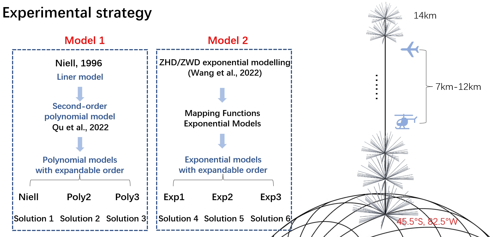

# Mapping Function Height Correction Models 

    

The repository offers a minimal dataset of model parameters and a MATLAB script for deriving the coefficient `a` of the mapping function from the provided tropospheric delay mapping function height correction models' parameters, specifically tailored to user-specified height locations.

Paper title: "A novel method for tropospheric delay mapping function vertical modeling"

## Background

 In high-precision space geodetic techniques data processing, the mapping function (MF) is a key factor in mapping the radio waves from the zenith direction down to the signal incoming direction. Existing MF products, either site-wise Vienna Mapping Function (VMF1 and VMF3) or grid-wise VMF1 and VMF3, are only available at the Earth surface, for overhead areas, height correction is always required. This is getting more and more crucial, particularly in today's world when air-borne aircraft activities are on the rise. In this contribution, we introduce a novel method aimed at providing a large number of MFs to the user in a simple and efficient manner, while minimizing the loss of precision. This innovative approach effectively represents the vertical profile of the MFs from the Earth's surface up to altitudes of 14 km.

The goal of this repository is to help users recover tropospheric delay mapping functions for user-specified height locations from the model parameters we provide.  It includes a total of 5 models, second-order and third-order polynomial models (Poly2 and Poly3), first-order, second-order and third-order multi-exponential models (Exp1, Exp2 and Exp3).

## Usage

Open MFmodel.m in MATLAB and run:

```matlab
MFmodel.m
```

## Installation

The downloaded files shall be organized as the following hierarchy:

> 1. A readme file named Readme.md (this doc).
> 2. A matlab script named MFmodel.m.
> 3. External dependencies of the above script, contains:
>    - caj2mjd.m
>    - mjd2cal.m
>    - vmf3.m
> 4. Data folder, contains:
>    - Data folders with epoch name (format: YYYYMMDDHH)
>      - Mapping functions data
>      - Models parameters data
>    - gridpoint_coord_5x5.txt


## Graphical Representation

<div align=center>

</div>

## License

[MIT](LICENSE) © Richard Littauer
